# Trabajo Practico N°1 - Práctico

**Integrantes**

- Enrique L. Graham.
- Franco I. Mamani.
- Simón Saillen.
- Rodrigo S. Vargas.

**Lenox Legends v2.0**

**Universidad Nacional de Córdoba - FCEFyN**

**Catedra de Redes de Computadoras**

**Profesores**

- Santiago M. Henn.
- Facundo N. 0. Cuneo.

**27/03/2025**

## Parte I - Configuración y Análisis de tráfico IPv4/IPv6

### 1. Marco Teórico Resumido

#### Protocolos IPv4 e IPv6

El protocolo IPv4 ha sido la base de las redes durante decadas, utilizando direcciones de 32 bits (como 192.168.1.10) para identificar dispositivos. Sin embargo, su limitado espacio de direcciones la dependencia de tecnologias como NAT han impulsado la adopcion de IPv6, que emplea direcciones de 128 bits (por ejemplo, 2001:aaaa:bbbb:1::10). Esta notacion hexadecimal no solo resuelve agotamiento de direcciones, sino que tambien introduce mejoras en seguridad, autoconfiguracion y eficiencia en el enrutamiento.

#### Mecanismos de Reloucion de Direcciones

En IPv4, el protocolo ARP(Adress Resolution Protocol) se encarga de traducir direcciones IP a direcciones MAC. Por ejemplo, cuando un host necesita comunicarse con otro en la misma red, envia una solicitud ARP para obtener la direccion fisica de destino. En cambio, IPv6 utiliza NDP (Neighbor Discovery Protocol), que no solo reemplaza a ARP, sino que tambien incorpora funciones avanzadas como la deteccion de routers vecinos y la autoconfiguracion de direcciones. NDP opera mediante mensajes como Neighbot Solicitation y Neighbot Advertisement, que se transmiten de manera mas eficiente usando multicast en lugar de broadcast.

#### ICMP y Diagnostico de Red

Tanto IPv4 como IPv6 emplean versiones del protocolo ICMP para tareas de diagnostico y manejo de errores. En IPv4, el comando ping utiliza ICMPv4 para verificar la conectividad entre hosts. mientras que en IPv6 se usa ping6 con ICMPv6. Estos protocolos son escenciales para identificar problemas de red, como paquetes perdidos o rutas inaccesibles.

#### Dual Stack y Asignacion Dinamica de Direcciones

La tecnologia dual stack permite que los dispositivos ~~~direccion IPv4 y otra IPv6 a cada interfaz de red. Esto facilita la transmision gradual hacia IPv6 sin interrumpir servicios existentes. Ademas, la asignacion dinamica de direcciones puede realizarse mediante DHCP en IPv4 o combinando DHCPv6 y SLAAC(Stateless Autoconfiguration) eb IPv6 lo que simplifica la administracion de redes grandes.

### 2. Construcción de Simulación de Red propuesta

Archivo de simulación dentro de carpeta `/Lab1/Simulation`.

#### Configuración de Simulación

<div style="display: flex; justify-content: center; gap: 10px;">
    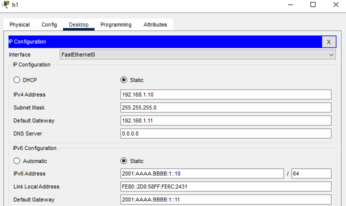
    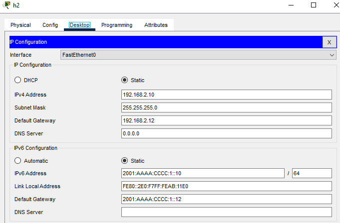
    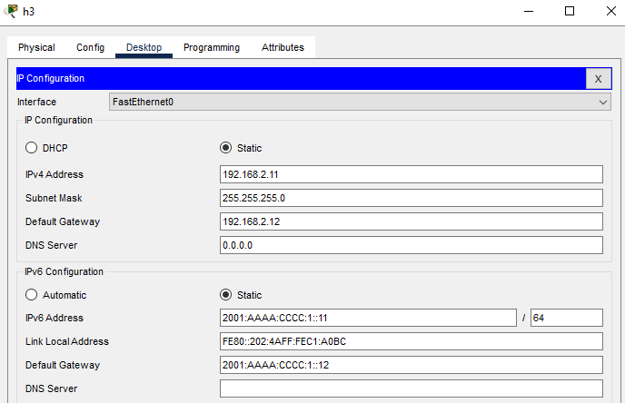
</div>
<br>
<div style= "display: flex; justify-content: center;">
    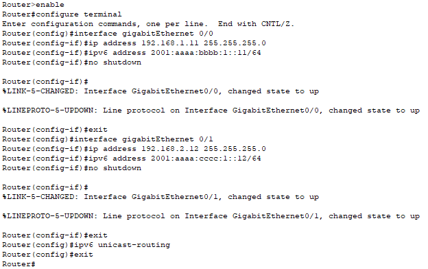
</div>

### 3. Diferencias entre Simulador y Emulador

Distinguir entre **simuladores** y **emuladores** es importante, ya que cada herramienta cumple propósitos específicos en el diseño, análisis e implementación de infraestructuras de red.

**Simuladores de Redes**

_Definición y Características:_  
_Un simulador de redes es una herramienta software que modela el comportamiento teórico de dispositivos, protocolos y topologías de red mediante algoritmos y representaciones abstractas._

Su enfoque se centra en:

- **Abstracción funcional:** No utiliza implementaciones reales de sistemas operativos o firmware.
- **Entornos controlados:** Permite probar escenarios bajo condiciones ideales o predefinidas.
- **Bajo consumo de recursos:** Optimizado para ejecutarse en hardware estándar sin requerimientos elevados.

**_Casos de Uso_**

- Enseñanza de conceptos básicos de redes (ej: funcionamiento de switches, enrutamiento estático).
- Pruebas de conectividad simple o validación de dise
- ños teóricos.
- Laboratorios académicos donde la prioridad es la comprensión conceptual.

**_Herramientas Representativas_**

- **Packet Tracer (Cisco):** Simula comandos básicos de dispositivos Cisco.
- **NetSim:** Utilizado para modelar protocolos de capas OSI y analizar tráfico.

---

**Emuladores de Redes**

_Definición y Características:_  
_Un emulador de redes replica el funcionamiento real de dispositivos mediante la ejecución de imágenes binarias de sistemas operativos específicos (ej: Cisco IOS, VyOS)._

Sus aspectos clave incluyen:

- **Alto realismo:** Permite configuraciones idénticas a las de hardware físico.
- **Integración con infraestructuras reales:** Puede conectarse a dispositivos físicos o nubes públicas.
- **Demanda de recursos:** Requiere hardware potente

**_Casos de Uso_**

- Implementación de redes empresariales complejas
- Pruebas de interoperabilidad entre dispositivos de múltiples fabricantes.
- Preparación para certificaciones profesionales

**_Herramientas Representativas_**

- **GNS3:** Emula routers, switches y firewalls usando imágenes reales de Cisco, Juniper y otros vendors.
- **CORE:** Herramienta que permite la emulación de redes informáticas en una o varias máquinas, aunqeu también puede conectarse a entornos de red reales.

---

**Tabla Comparativa**

| **Aspecto**               | **Simulador**                       | **Emulador**                           |
| ------------------------- | ----------------------------------- | -------------------------------------- |
| **Nivel de realismo**     | Modelos teóricos simplificados      | Réplica exacta de sistemas operativos  |
| **Recursos requeridos**   | Hardware básico                     | Hardware especializado (CPU/RAM alta)  |
| **Flexibilidad**          | Limitada a funciones preprogramadas | Configuración granular y personalizada |
| **Entorno de aplicación** | Académico/Educativo                 | Profesional/Investigación avanzada     |
| **Ejemplos**              | Packet Tracer, NetSim               | GNS3, EVE-NG, CORE                     |

---

La elección entre simuladores y emuladores depende directamente de los objetivos del proyecto. Mientras los simuladores ofrecen un entorno accesible para la asimilación de conceptos fundamentales, los emuladores brindan la precisión técnica necesaria para escenarios realistas y profesionales. En el contexto de la Ingeniería en Computación, dominar ambas herramientas permite abordar desde problemas pedagógicos hasta desafíos de implementación en entornos productivos, consolidando así una formación integral en redes de computadoras.

### 4. Evaluar conectividad entre 3 host IPv4

<div style="display: flex; justify-content: center; gap: 10px;">
    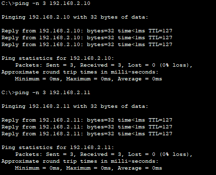
    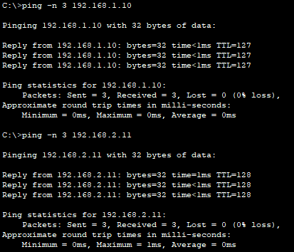
    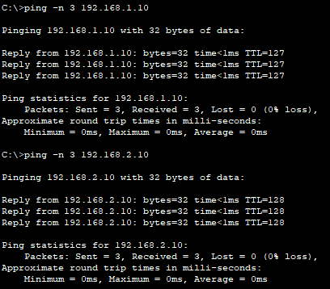
</div>

### 5. Evaluar conectividad entre 3 host IPv6

<div style="display: flex; justify-content: center; gap: 10px;">
    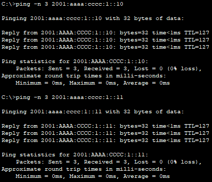
    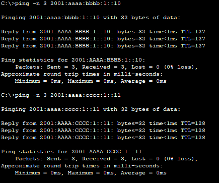
    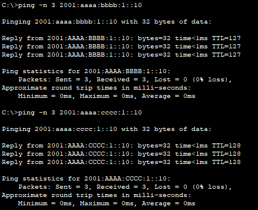
</div>

### 6. Analisis de trafico ICMP entre 2 redes

#### a.

Las comunicaciones que se observan son debido a que cuando un dispositivo se quiere comunicar con otro de la misma red pero no se conoce su dirección MAC, envía una solicitud **ARP Request** para averiguarla, luego el dispositivo al que se hace el llamado responde con un **ARP Reply** con la dirección MAC propia.

#### b.

##### Datagramas

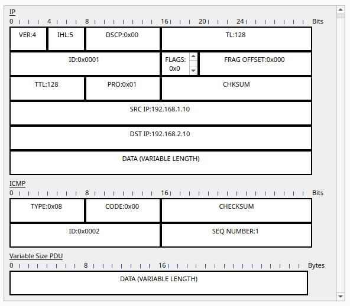

**Source**: 192.168.1.10 (h1)
<br>
**Destination**: 192.168.2.10 (h2)

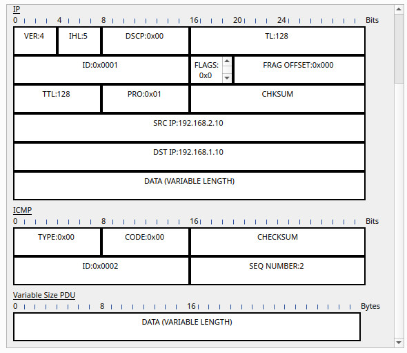

**Source**: 192.168.2.10 (h2)
<br>
**Destination**: 192.168.1.10 (h1)

#### c.

El enrutador determina la comunicación entre hosts consultando su **tabla de enrutamiento** y enviando el paquete por la mejor ruta disponible.

1. **Misma red:** Si el destino está en la misma subred, el host lo envía directamente.
2. **Red diferente:** Si el destino está en otra subred, el paquete va al **gateway predeterminado** (router).
3. **Búsqueda en la tabla de rutas:** El router revisa su tabla y reenvía el paquete por la interfaz correcta.
4. **Resolución de dirección:** Usa **ARP (IPv4)** o **NDP (IPv6)** para encontrar la dirección MAC del siguiente salto.
5. **Entrega final:** El paquete llega al router del destino, que lo envía al host correspondiente.

**Ejemplo**:  
H1 (`192.168.1.10`) quiere comunicarse con H2 (`192.168.2.10`). Como están en redes distintas, H1 envía el paquete al router (`192.168.1.11`), que lo reenvía por la interfaz `192.168.2.12` hasta H2.

#### d.

El switch sirve para interconectar dispositivos en una misma red local (LAN).
Los switches son de Capa 2 (Enlace de Datos), por lo que solo trabajan con MAC, a diferencia de los de Capa 3 que necesitan IP.

#### e.

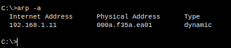 
- 192.168.1.11: dirección IP del router en la red de H1.
- 00:0A:F3:5A:EA:01: dirección MAC del router.
- Dynamic: Significa que esta entrada se obtuvo mediante una petición ARP automática y no configurada manualmente.

#### f.

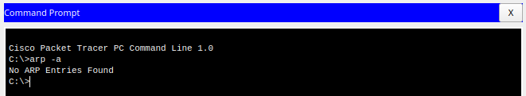
Como h3 no ha intentado comunicarse con otras direcciones IP, no hay entradas en su tabla ARP.

#### g.

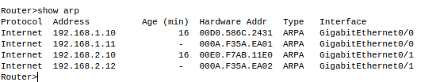

- Protocol: El protocolo de red que utiliza la entrada.

- Address: La dirección IP asociada con la dirección MAC correspondiente.

- Age (min): El tiempo en minutos desde que se aprendió la dirección MAC asociada con la dirección IP. Caso "-" significa que la entrada es estática.

- Hardware Addr: La dirección MAC asociada a la dirección IP.

- Type: El tipo de la entrada ARP. "ARPA" es un estándar para la resolución de direcciones IP en direcciones MAC en redes Ethernet.

- Interface: La interfaz del router por la que se encuentra dicha dirección IP.

#### h.

En IPv4, una **dirección de broadcast** es una dirección especial que se usa para enviar paquetes a todos los dispositivos en una red específica, en lugar de enviarlos a un único dispositivo.

##### Utilidad

1. **Difusión de Información**: Permite enviar mensajes a todos los dispositivos en la red sin necesidad de especificar cada dispositivo.
2. **Protocolos de Descubrimiento**: Usada en DHCP y ARP para resolver direcciones o anunciar servicios.
3. **Eficiencia**: Facilita la comunicación simultánea a todos los dispositivos de una red.

Su uso excesivo puede generar congestión en la red, por lo que debe ser controlado.

#### i.

Las **direcciones de multicast** en IPv4 permiten enviar paquetes de datos a un grupo específico de dispositivos en lugar de a todos (broadcast) o a uno solo (unicast). Están en el rango `224.0.0.0` a `239.255.255.255`.

##### Utilidad

1. **Comunicación eficiente**: Permiten enviar mensajes a múltiples dispositivos sin duplicar los datos.
2. **Protocolos de transmisión**: Usadas en aplicaciones como streaming, videoconferencias y servicios de transmisión.
3. **Redes de alta eficiencia**: Utilizadas en protocolos como IGMP y PIM para gestionar grupos multicast.

   - Internet Group Management Protocol (IGMP): IGMP gestiona los miembros de los grupos de multidifusión IPv4 y se ejecuta en el extremo de una red de multidifusión. Los hosts utilizan el protocolo IGMP para unirse o abandonar grupos multicast.

   - Protocol Independent Multicast (PIM): PIM se ejecuta en una red IPv4 y envía datos multicast a dispositivos multicast conectados a miembros del grupo interesados en los datos.

Son esenciales para optimizar la distribución de datos en aplicaciones que requieren comunicación a varios dispositivos simultáneamente.

### 7. Analisis de trafico ICMPv6 entre 2 redes

#### a.

#### b y c.

Sí, **NDP (Neighbor Discovery Protocol)** reemplaza a **ARP (Address Resolution Protocol)** en IPv6.
En IPv4, ARP se usa para resolver direcciones IP a direcciones MAC, pero en IPv6 **ya no existe ARP**.  
En su lugar, **NDP** se encarga de estas funciones

| Característica                      | ARP (IPv4)                      | NDP (IPv6)                                 |
| ----------------------------------- | ------------------------------- | ------------------------------------------ |
| Resolución de direcciones           | Sí                              | Sí (Neighbor Solicitation / Advertisement) |
| Descubrimiento de routers           | No                              | Sí (Router Solicitation / Advertisement)   |
| Detección de direcciones duplicadas | No                              | Sí (Duplicate Address Detection - DAD)     |
| Mecanismo de comunicación           | **Broadcast** (consume más red) | **Multicast & Unicast** (más eficiente)    |

#### d.

IPv6 elimina el broadcast y lo reemplaza con multicast, unicast y anycast para mejorar la eficiencia de la red.

- **Multicast**: Envía paquetes solo a un grupo específico en lugar de toda la red. Ejemplo: `FF02::1` (todos los nodos), `FF02::2` (todos los routers).
- **Unicast**: Comunicación directa entre un solo emisor y un receptor.
- **Anycast**: Varios dispositivos comparten la misma dirección, pero el paquete se envía al más cercano.

En IPv4, ARP usa broadcast para resolver direcciones. En IPv6, esto se reemplaza con mensajes **Neighbor Solicitation (NS)** enviados por multicast.

#### e.

- **Link-Local (`FE80::/10`)**

  - Se usa para comunicación dentro de la misma red local (sin routers).
  - Se asigna automáticamente a cada interfaz.
  - Ejemplo: `FE80::1` para comunicación entre un host y su router.

- **Unique-Local (`FC00::/7`)**

  - Similar a las privadas en IPv4 (`192.168.x.x` o `10.x.x.x`), usadas dentro de una organización.
  - No se enrutan en Internet.
  - Ejemplo: `FD12:3456:789A::1` para comunicación interna en una empresa.

- **Global (`2000::/3`)**

  - Direcciones públicas que pueden comunicarse en toda Internet.
  - Asignadas por un proveedor de servicios de Internet (ISP).
  - Ejemplo: `2001:db8::1` para un servidor web accesible globalmente.

  **Ejemplo de uso**:

- **Link-Local**: Un PC se comunica con su router para obtener una dirección.
- **Unique-Local**: Una empresa usa `FDxx::` para su red privada interna.
- **Global**: Un servidor web público tiene una IP `2001:db8::1`.

## Parte II - Manejo de equipamiento físico, recuperación de contraseñas de equipos de red y establecimiento de red y análisis de tráfico.

### 1. Caracteristicas principales del Switch

**Basado en datasheet oficial**

- **Arquitectura:**
  - 24 puertos Ethernet 10/100BASE-TX.
  - 2 puertos Gigabit Ethernet uplink.
  - Backplane de 8.8 Gbps.
  - Memoria Flash: 8MB (para IOS).
  - RAM: 32 MB
- **Protocolos soportados:**
  - Spanning Tree Protocol (802.1D).
  - VLANs (802.1Q).
  - SNMP v2c/v3.
  - CDP (Cisco Discovery Protocol).
- **Consola:**
  - Puerto RJ-45 (9600 Baudios, 8N1, flujo de datos none).
  - Acceso mediante cable serie rollover (Cisco PINOUT: RJ-45 a DB-9).

### 2. Checklist de procedimientos

#### a. Conexion por consula con PUTTY

1. Hardware

   - Conectar el puerto de consola con un puerto usb a la PC1 usando un cable serie RJ-45 y un adaptador USB-Serie.

2. Configuracion de PUTTY

   - Tipo de conexion: Serial
   - puerto COM: Identificar en Administrador de dispositivos(windows).
   - Velocidad: **9600 baudios**.
   - Parámetros: 8bits de datos, 1 bit de parada, sin paridad, control de flujo: None.

3. Acceso:
   - Encender el switch y presionar Enter en PC1 para obtener prompt `Switch>`

#### b. Modificacion de contraseñas.

1. cambiar contraseña de modo privilegiado.

```
Switch> enable
Switch# configure terminal
Switch(config)# enable secret [clave_nueva]
Switch(config)# exit
```

2. Configurar contraseña para acceso por consola

```
Switch(config)# line console 0
Switch(config-line)# password ClaveConsola456
Switch(config-line)# login
Switch(config-line)# exit
```

3. Guardar la configuración

```
Switch(config)# copy running-config startup-config
```

#### c. Configuracion y conexion de red basica.

1. Conexion de PCs al Switch
   - **PC1**: Puerto FastEthernet0/1.
   - **PC2**: Puerto FastEthernet0/2.
   - **PC3 (para monitoreo)**: Puerto FastEthernet0/3.
2. Configuracion de las IPs en las PCs

En windows:

```
#PC1:
netsh interface ip set adress name="Ethernet" static 192.168.1.10 255.255.255.0

#PC2:
netsh interface ip set adress name="Ethernet" static 192.168.1.11 255.255.255.0
```

En linux:

```
#PC1:
sudo ip addr add 192.168.1.10/24 dev eth0

#PC2:
sudo ip addr add 192.168.1.11/24 dev eth0
```

3. Prueba de conectividad

```
#Desde PC1:
ping 192.168.1.11

#PC2:
ping 192.168.1.10
```

#### d. Configuracion de Port Mirroring (SPAN) con capturas de trafico

1. Habilitar SPAN en el Switch

```
Switch# configure terminal
Switch(config)# monitor session 1 source interface FastEthernet0/1 both
Switch(config)# monitor session 1 destination interface FastEthernet0/3
Switch(config)# end
```
2. Configurar Wireshark en PC3
3. Abrir Wireshark y seleccionar interfaz de red.
4. Aplicar filtros:
   - `arp` para ver solicitudes/respuestas ARP.
   - `icmp` para trafico de ping
5. Ejecutar el comando `ping` en PC1 o PC2 para observar la captura del trafico.

### 3. Resumen de la experiencia práctica

Durante la interacción con el equipo físico y la implementación de la red, se observaron los siguientes aspectos clave:

#### 1. Interacción con el hardware

- **Conexión física:**  
  - Los puertos FastEthernet del switch se etiquetaron claramente, facilitando la conexión de las PCs.  
  - Se verificó el estado de los LEDs de los puertos para confirmar actividad (link/actividad).
    


- **Desafíos:**  
  - Inicialmente, el puerto de consola no respondía debido a un cable RJ-45 dañado. Se resolvió reemplazándolo.  
  - Dificultad para identificar el puerto COM correcto en Windows (solución: revisar el Administrador de dispositivos).
    
  

#### 2. Configuración del switch

- **Acceso por consola:**  
  - Uso de PuTTY con parámetros seriales (`9600 baudios, 8N1`) fue crítico para acceder al CLI del switch.


  - El prompt `Switch>` apareció, al ya estar configurado tuvimos que probar contraseñas clasicas para poder reconfigurarlo.
    


- **Cambio de contraseñas:**  
  - La configuración de `enable secret` aseguró el acceso privilegiado, pero se olvidó guardar con `copy running-config startup-config` en el primer intento, perdiendo los cambios.


#### 3. Comunicación entre PCs

- **Configuración IP estática:**  
  - Tanto en Windows como en Linux funcionó correctamente la configuracion manual de IP.


- **Pruebas de conectividad:**  
  - El primer `ping` entre PC1 y PC2 falló por firewall de Windows bloqueando ICMP. Se resolvió desactivando temporalmente el firewall.  
  - Se observó que el TTL variaba según el SO: Windows (128) vs Linux (64).
  


#### 4. Port Mirroring y análisis de tráfico

- **Configuración SPAN:**
  - Wireshark mostró correctamente paquetes ARP (para resolución de MAC) e ICMP tras ajustar los filtros.

#### 5. Lecciones aprendidas

1. **Verificación física:**
   - Chequear cables y LEDs antes de asumir errores de configuración.
2. **Documentación:**
   - Anotar contraseñas nuevas inmediatamente (¡el "enable secret" no se puede recuperar fácilmente!).
3. **Herramientas de diagnóstico:**
   - Comandos como `show interfaces status` en el switch y `arp -a` en las PCs fueron esenciales para resolver problemas.

### Conclusion

La experiencia presencial reforzó la importancia de:

- La **metodología ordenada** (seguir checklists).
- El **análisis de fallas en capas** (física → enlace → red).
- La **integración entre hardware y software**, donde pequeños detalles (ej: parámetros de PuTTY) impactan en resultados globales.
