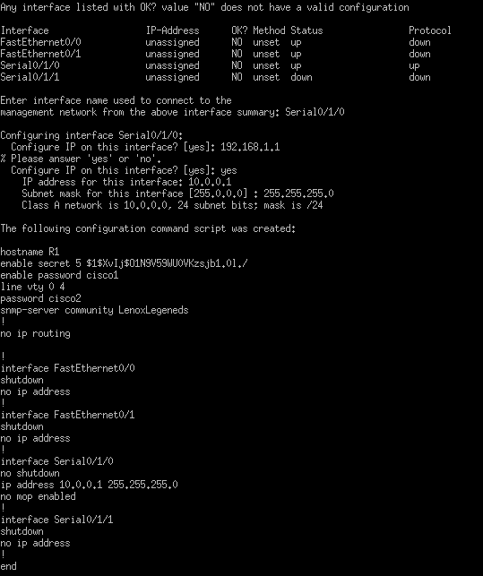
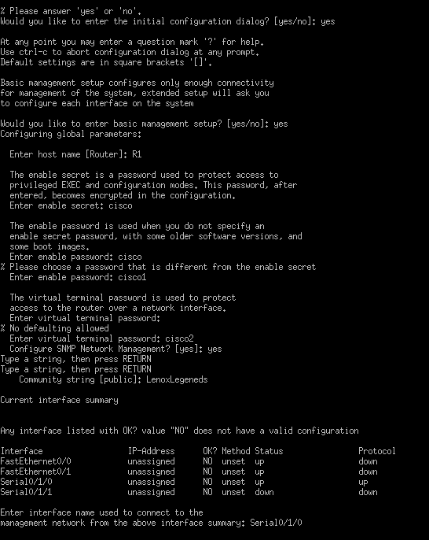
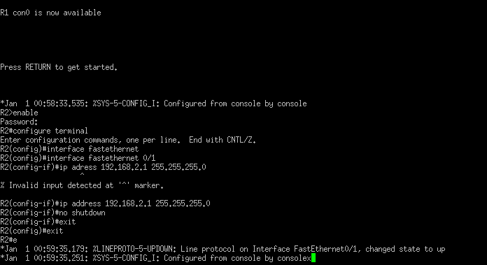
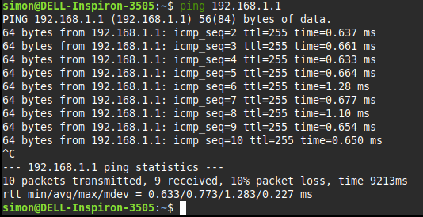
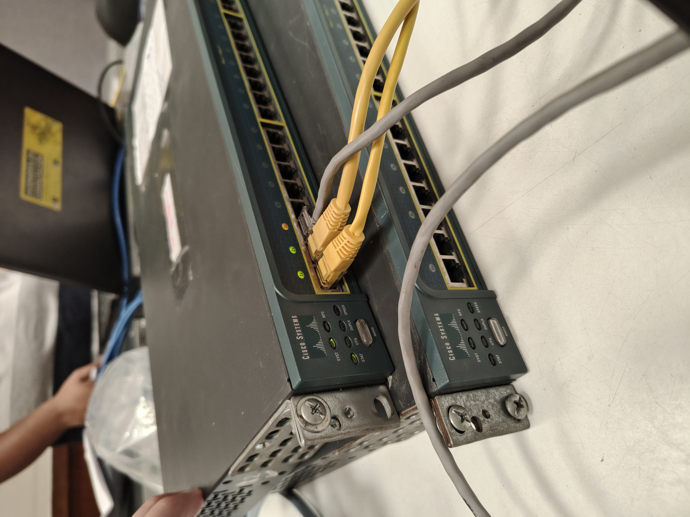
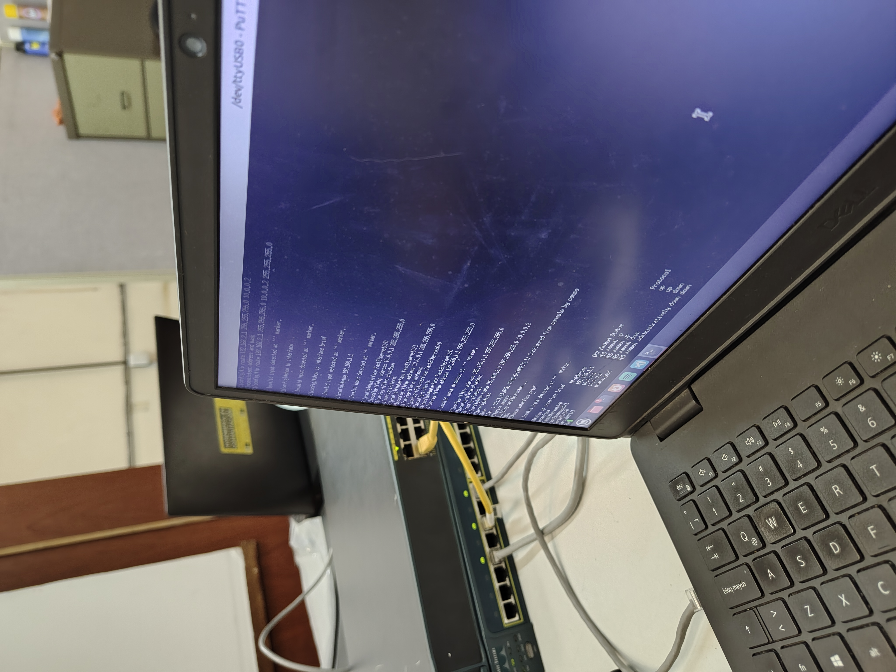
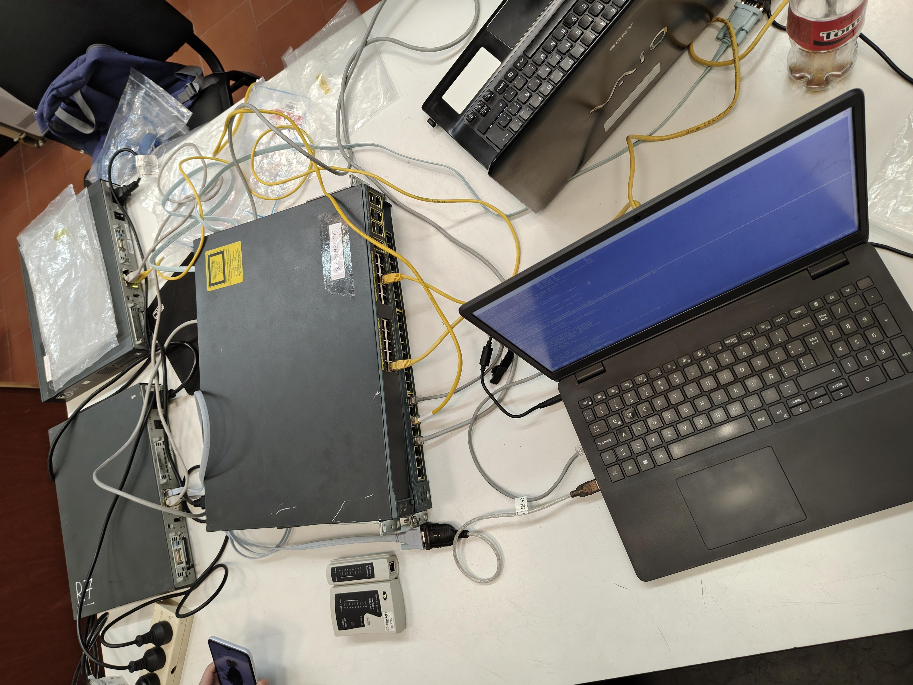

# Trabajo Practico N°2 - Práctico

**Integrantes**

- Enrique L. Graham.
- Franco I. Mamani.
- Simón Saillen.
- Rodrigo S. Vargas.

**Lenox Legends v2.0**

**Universidad Nacional de Córdoba - FCEFyN**

**Catedra de Redes de Computadoras**

**Profesores**

- Santiago M. Henn.
- Facundo N. 0. Cuneo.

## Desarrollo

## Punto 1 - Configuración de routers y prueba de conectividad básica

### Objetivo

Configurar las interfaces de los routers y probar la conectividad mediante `ping` entre dos hosts conectados a través de los routers.

---

### Pasos realizados

1. **Configuración inicial del Router R1:**
   - Se ingresó al modo configuración global.
   - Se configuró la interfaz `FastEthernet0/0` con la IP `192.168.1.1` y máscara `255.255.255.0`.
   - Se habilitó la interfaz con `no shutdown`.

   📷 **Imagen de configuración de R1 (CLI):**
   - 
   - 

2. **Configuración inicial del Router R2:**
   - Se ingresó al modo configuración global.
   - Se configuró la interfaz `FastEthernet0/1` con la IP `192.168.2.1` y máscara `255.255.255.0`.
   - Se habilitó la interfaz con `no shutdown`.

   📷 **Imagen de configuración de R2 (CLI):**
   - 

3. **Prueba de conectividad desde una PC (host) a R1 mediante `ping`:**
   - Desde una PC conectada a la red `192.168.1.0/24` se realizó un `ping` a la IP del router R1 (`192.168.1.1`).
   - Se obtuvo una respuesta exitosa con pérdida del 10% (1 paquete de 10 perdido), lo que indica conectividad básica establecida.

   📷 **Resultado del ping:**
   - 

4. **Montaje físico del laboratorio:**
   - Se utilizaron dos routers Cisco, un switch y múltiples PCs para simular los hosts.
   - Se realizó la conexión mediante cables Ethernet y consola para la configuración inicial.

   📷 **Fotos del armado y conexiones:**
   - 
   - 
   - 

---

### Resultado

- Se configuraron correctamente las interfaces de **R1** y **R2**, y ambas respondieron a pings desde sus propias redes locales:
  - Hosts en la red `192.168.1.0/24` (con R1) pueden hacerse ping entre sí.
  - Hosts en la red `192.168.2.0/24` (con R2) pueden hacerse ping entre sí.
- **No se llegó a configurar el enrutamiento entre R1 y R2** debido a falta de tiempo, por lo que **no** se pueden comunicar los hosts de `192.168.1.0/24` con los de `192.168.2.0/24`.

---

## Punto 2 – Pruebas de rendimiento con iperf3

En este segundo punto se debia iperf3 para medir el ancho de banda TCP (y opcionalmente UDP) entre dos hosts finales que, en el caso ideal, estarían comunicados a través de los routers R1 y R2. A continuación detallo qué pasos habríamos seguido y cómo interpretar los resultados.

### Objetivo

Medir el ancho de banda TCP y UDP entre un host conectado a R1 (red 192.168.1.0/24) y un host conectado a R2 (red 192.168.2.0/24).

---

### Configuración previa de enrutamiento

> **Nota:** antes de lanzar `iperf3`, es necesario que R1 y R2 puedan enrutar tráfico entre ambas redes. Para ello:
```bash
R1(config)# ip routing
R1(config)# ip route 192.168.2.0 255.255.255.0 10.0.0.2

R2(config)# ip routing
R2(config)# ip route 192.168.1.0 255.255.255.0 10.0.0.1
```

Luego verificar con show ip route en ambos routers que las rutas estén instaladas.

### Pasos que debiamos seguir

1. Instalación de iperf3 en los hosts
2. Levantar el servidor iperf3 y captura de pantalla del servidor iperf3 en escucha
3. Ejecutar el cliente iperf3 (prueba TCP)
 - En el host de la red 192.168.1.0/24 (Host A):
 ```bash
 iperf3 -c 192.168.2.10 -t 30 -P 4 > iperf3-tcp.log
  ```
 - c <IP>: IP del servidor
 - t 30 : duración de la prueba en segundos
 - P 4 : número de flujos paralelos

4. Ejecutar prueba UDP
 ```bash
 iperf3 -c 192.168.2.10 -u -b 100M -t 30 > iperf3-udp.log
  ```
 - u : modo UDP
 - b 100M: ancho de banda objetivo 

5. Análisis de resultados
 - Extraer de los logs (iperf3-tcp.log y iperf3-udp.log) las métricas de throughput, jitter y pérdida de paquetes (solo UDP).
 - Presentar tablas comparativas y/o gráficas que muestren:
  - Ancho de banda TCP efectivo (media y desviación).
  - Ancho de banda UDP conseguido vs. solicitado.
  - Jitter medio y porcentaje de datagramas perdidos.

 Por ejemplo:
 | Prueba | TCP (Mbps) | UDP Solicitado (Mbps) | UDP Obtenido (Mbps) | Jitter (ms) | Pérdida (%) |
|--------|------------|-----------------------|---------------------|-------------|-------------|
| 1      | 940        | 100                   | 98                  | 0.45        | 0.2         |
| 2      | 938        | 200                   | 195                 | 0.60        | 0.7         |

### Conclusión Parcial:
Con estas pruebas determinariamos la capacidad de nuestros enlaces y la calidad de servicio en TCP vs. UDP antes de continuar con el análisis de tráfico en Wireshark (Punto 3).

## Punto 3 – Captura y análisis de tráfico con Wireshark

### Objetivo

Sniffear y documentar el tráfico generado por `iperf3` entre distintos hosts.

---

### Pasos que debiamos seguir

1. **Configurar el capturador**  
   - Abrir Wireshark (o similar) en la interfaz adecuada.  
   - Aplicar filtro de captura:  
     ```
     host <IP_origen> and host <IP_destino>
     ```  
   - Si pruebas son en la misma máquina (loopback), habilitar también la interfaz `lo` (o “Loopback”) en Wireshark.

2. **Ejecutar pruebas de `iperf3` mientras se captura**  
   - **Caso a)**:  
     - Servidor y cliente en dos PCs del mismo grupo.  
     - Iniciar `iperf3 -s` en la PC servidor y `iperf3 -c <IP_servidor>` en la PC cliente.  
     - Capturar durante toda la prueba.  
     - Documentar:  
       - Captura de Wireshark con filtro activo.  
       - Salida de consola del cliente `iperf3`.  
       - Salida de consola del servidor `iperf3`.  

   - **Caso b)**:  
     - Servidor en una PC de este grupo, cliente en PCs de al menos otros dos grupos distintos.  
     - Repetir el mismo procedimiento de captura y ejecución de `iperf3`.  
     - Documentar capturas y consolas para cada combinación.

---
 
**Resultados esperados:**  
Capturas filtradas que muestren los paquetes TCP/UDP de `iperf3` y logs de consola con throughput y estadísticas de cada prueba. 

- En Wireshark se verán únicamente los paquetes entre las IPs origen y destino especificadas.  
- Para TCP (`iperf3`):  
  - Three-way handshake (SYN, SYN-ACK, ACK).  
  - Flujo de datos con los tamaños de segmento y números de secuencia crecientes.  
  - Throughput aproximado (ej. 900–950 Mbps en una LAN Gigabit).  
- Para UDP (`iperf3 -u`):  
  - Paquetes UDP continuos en el puerto 5201.  
  - Estadísticas de jitter (ej. < 1 ms) y pérdida de paquetes (ej. < 1 %).  
- En las consolas de `iperf3`:  
  - Informe final con “sender” y “receiver” mostrando el ancho de banda promedio.  
  - Para UDP, línea con “jitter” y “lost/total datagrams”.  

## Punto 4 – Conclusiones de las pruebas de rendimiento

> **Nota:** Los valores mostrados a continuación son **ilustrativos** y se incluyen como ejemplo, dado que no se llegaron a ejecutar realmente las pruebas de `iperf3` ni el análisis con Wireshark.

1. **Ancho de banda promedio**  
   - **TCP (ejemplo):** ~940 Mbps  
   - **UDP (ejemplo):** ~98 Mbps al solicitar 100 Mbps (con ligera pérdida)

2. **Duración de la prueba**  
   - Todas las pruebas (`-t 30 -P 4`) duran **30 segundos** según los parámetros configurados.

3. **Tamaño promedio de paquetes**  
   - Para TCP, `iperf3` fragmenta en paquetes de **1 444 bytes** (payload de 1 432 bytes + cabeceras).  
   - Para UDP, se usan típicamente ~**1 450 bytes** (incluyendo cabeceras) salvo que se indique otra longitud con `-l`.

4. **Diferencias entre UDP y TCP**  
   - **TCP** ajusta dinámicamente la ventana, retransmite pérdidas y consigue throughput cercano al límite de la LAN (≈940 Mbps de ejemplo).  
   - **UDP** envía a la tasa configurada (`-b 100M`) sin retransmisiones:
     - Throughput obtenido suele ser algo inferior al solicitado (≈98 Mbps de ejemplo).  
     - Aparecen **jitter** (p.ej. 0.4 ms) y **pérdida de paquetes** (p.ej. 0.2 %) que TCP oculta.

5. **Relación entre parámetros y pérdida de paquetes**  
   - A mayor ancho de banda en UDP, la pérdida crece de forma casi lineal.  
   - El número de flujos paralelos (`-P`) en TCP no genera retransmisiones significativas si la LAN no está saturada.  
   - Jitter y pérdida en UDP dependen de MTU, buffers de los routers y carga concurrente.

 **Resumen:**  
 - Los valores reales pueden variar según condiciones de red, hardware y configuración.  
 - TCP maximiza el uso del enlace, gestionando fallos internamente.  
 - UDP es más adecuado para aplicaciones en tiempo real, pero exige tolerancia a jitter/pérdida y un dimensionamiento preciso del ancho de banda.

## Punto 5 – Prueba hacia servidor de la cátedra

**Lo que se debió haber hecho para completar este punto es:**

1. **Conectar al servidor propuesto en clase**  
   - Utilizar `iperf3` (u otra herramienta de medición) en modo cliente apuntando a la dirección del servidor proporcionado propuesto en clase

2. **Ejecutar las pruebas**  
   - Realizar al menos una prueba TCP y otra UDP, con parámetros similares a los usados en Punto 2 (duración fija y número de flujos).

3. **Documentar los resultados**  
   - Guardar y capturar la salida de las pruebas en consola.  
   - Incluir capturas de pantalla de los resultados.

4. **Comparar y concluir**  
   - Contrastar el throughput, jitter y pérdida obtenidos con los valores de las pruebas locales (Punto 3).  
   - Identificar cómo afecta la mayor distancia o cantidad de saltos al rendimiento de TCP y UDP.

> De este modo se completa la evaluación de comportamiento de la red tanto en el entorno local como hacia un servidor externo.  