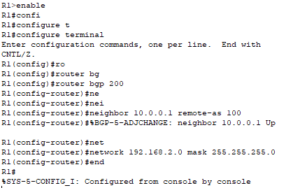

# Trabajo Practico N°4: Protocolo de Puerta de Enlace Fronteriza (BGP) y Sistemas Autónomos (AS)

**Integrantes**

- Enrique L. Graham.
- Franco I. Mamani.
- Simón Saillen.
- Rodrigo S. Vargas.

**Lenox Legends v2.0**

**Universidad Nacional de Córdoba - FCEFyN**

**Catedra de Redes de Computadoras**

**Profesores**

- Santiago M. Henn.
- Facundo N. 0. Cuneo.

## Desarrollo

### Parte I - Integración de Conceptos, Actividades Online e Investigación

#### Actividad 1:

**a. ¿Qué es un Autonomous System (AS)?**

Un Sistema Autónomo (AS) es un conjunto de redes IP y routers bajo el control de una única entidad administrativa que presenta una política de enrutamiento común al exterior. Cada AS es identificado por un número único conocido como Número de Sistema Autónomo (ASN).

**b. ¿Qué es un Autonomous System Number (ASN) y cómo está conformado?**

Un Autonomous System Number (ASN) es un número único asignado a cada Sistema Autónomo para identificarlo en el contexto del enrutamiento BGP. 

Los ASN pueden ser de `16 bits` o de `32 bits`. Los ASN de `16 bits` están en el rango de 1 a 65534, mientras que los ASN de `32 bits` están en el rango de 131072 a 4294967294. Estos números se presentan en el formato AS(número). Por ejemplo, el ASN de Cloudflare es `AS13335`. Según algunas estimaciones, hay más de 90,000 ASN en uso en todo el mundo.

**c. Buscar 3 ejemplos de ASN de empresas, universidades u organizaciónes**

1. `AS15169` - **Google LLC**: Este ASN es utilizado por Google para sus servicios de búsqueda, publicidad y otros productos en línea.
2. `AS27790` - **Universidad Nacional de Córdoba (UNC)**: Este ASN es utilizado por la universidad para sus redes y servicios académicos.
3. `AS8659` - **United Nations International Computing Centre (UNICC)**: Este ASN es utilizado por el Centro Internacional de Informática de las Naciones Unidas para sus operaciones y servicios tecnológicos.

**d. ASN de mi conexión Actual**

Mi conexión actual utiliza el ASN **AS11664**, que pertenece a **Techtel LMDS Comunicaciones Interactivas S.A.** que corresponde a la empresa de telecomunicaciones **CLARO** en Argentina. Este ASN es utilizado para proporcionar servicios de internet y telecomunicaciones a clientes residenciales y empresariales.

Información adicional sobre el ASN de mi conexión:
- **Niveles de Tráfico**: 1-5 Tbps.
- **Protocolos Soportados**: Unicast IPv4, Multicast, IPv6.
- **Prefijos IPv4**: 3000.
- **Prefijos IPv6**: 600.

>[!NOTE]
>Para mas información sobre el ASN de mi conexión, referirse al archivo `Lab4/Archivos/AS11664.json`.

#### Actividad 2:

**a. ¿Qué es el Border Gateway Protocol (BGP)?**

El Protocolo de Puerta de Enlace Fronteriza (BGP) es el protocolo de enrutamiento utilizado para intercambiar información de enrutamiento entre Sistemas Autónomos (AS) en Internet. BGP es un protocolo de vector de ruta que utiliza políticas de enrutamiento para determinar la mejor ruta para el tráfico entre diferentes AS.

**b. Resumir el funcionamiento del BGP a través de sus procedimientos funcionales: adquisición de vecino, detección de vecino alcanzable, detección de red alcanzable. Explicar tipos de mensajes y formato de paquetes en BGP.**

El funcionamiento de BGP se basa en varios procedimientos funcionales clave:

1. **Adquisición de Vecino**: BGP establece conexiones entre routers vecinos (peers) para intercambiar información de enrutamiento. Esto se realiza a través de la apertura de una sesión TCP en el puerto 179.
2. **Detección de Vecino Alcanzable**: Una vez que se establece la conexión, los routers intercambian mensajes de apertura (OPEN) para negociar parámetros de la sesión, como el ASN del vecino y las capacidades del protocolo.
3. **Detección de Red Alcanzable**: Los routers intercambian mensajes de actualización (UPDATE) que contienen información sobre las rutas disponibles y las políticas de enrutamiento. Estos mensajes incluyen prefijos IP, atributos de ruta y otros datos necesarios para determinar la mejor ruta.

Tipos de Mensajes y Formato de Paquetes en BGP:

Todos los mensajes BGP comparten un encabezado común y tienen una longitud máxima de 4096 bytes.

Formato del Encabezado Común de BGP (19 bytes):

| Campo	| Longitud (octetos) | Descripción |
|---|---|---|
| Marker | 16 | Se utiliza para sincronización y     autenticación. Si no hay autenticación, se llena con todos los bits a 1. |
| Length | 2 | Longitud total del mensaje BGP (incluyendo el encabezado), en octetos. Rango: 19 a 4096. |
| Type| 1 | Tipo de mensaje BGP (1: OPEN, 2: UPDATE, 3: NOTIFICATION, 4: KEEPALIVE, 5: ROUTE-REFRESH). |

Tipos de Mensaje BGP:

- **OPEN**: Establece una sesión BGP entre vecinos y negocia parámetros.
- **UPDATE**: Anuncia nuevas rutas o retira rutas existentes.
- **NOTIFICATION**: Informa sobre errores o condiciones especiales en la sesión BGP.
- **KEEPALIVE**: Mantiene viva la sesión BGP enviando mensajes periódicos para evitar el cierre de la conexión.
- **ROUTE-REFRESH**: Solicita al vecino que reenvíe sus rutas actuales sin cerrar la sesión.

**c. Explicar la diferencia entre BGP Externo (eBGP) y BGP Interno (iBGP) en función de la información que se intercambia dentro de un AS. En el siguiente ejemplo ¿Cuál(es) AS son de tránsito?**

    

En funcion de la información que se intercambia dentro de un Sistema Autónomo (AS), la diferencia entre BGP externo e interno es la siguiente:

- **BGP Externo (eBGP)**: Se utiliza para intercambiar información de enrutamiento entre diferentes Sistemas Autónomos. En el ejemplo, los AS1, AS2 y AS3 están intercambiando información de enrutamiento entre ellos a través de eBGP.
- **BGP Interno (iBGP)**: Se utiliza para intercambiar información de enrutamiento dentro de un mismo Sistema Autónomo. En el ejemplo, los routers dentro del AS2 están intercambiando información de enrutamiento a través de iBGP.

En el ejemplo proporcionado, los AS que actúan como tránsito es **AS2**, actúa como tránsito para el tráfico entre **AS1** y **AS3**.

**d. Buscar las conexiones del AS en mi conexión actual. ¿Cuántas conexiones eBGP tiene mi AS?, incluir un gráfico de los AS a uno o dos grados de separación.**

Mi conexión actual utiliza el ASN **AS11664**.

    

Al buscar las conexiones eBGP de este AS, encontramos que tiene varias conexiones con otros AS, estas son (separadas por grados de separación):

- 1 grado: `AS19037`, `AS3257`, `AS1299`, `AS6762`, `AS6939`.
- 2 grados: `AS174`, `AS5511`, `AS6830`, `AS2497`, `AS2914`, `AS3356`, `AS6461`, `AS7018`, `AS6453`, `AS5391`.
- 3 grados: `AS3549` y `AS209`.

**e. Buscar las conexiones del AS conectándome a alguna red distinta a la del punto anterior (puede ser 4G/5G de mi teléfono, alguna red en la facultad, etc.). ¿Qué diferencias/similitudes puedo identificar?**

Usando la conexión de mi teléfono móvil (4G/5G), encontramos que el ASN utilizado es **AS7303** (utilizando la página web https://bgp.he.net/), que pertenece a **Telecom Argentina S.A.** empresa que fue comprada por Personal. 

    

Conexiones eBGP de **AS11664**:

`AS19037`, `AS3257`, `AS1299`, `AS6762`, `AS6939`, `AS174`, `AS5511`, `AS6830`, `AS2497`, `AS2914`, `AS3356`, `AS6461`, `AS7018`, `AS6453`, `AS5391`, `AS3549`, `AS209`.

Conexiones eBGP de **AS7303**:

`AS1299`, `AS6939`, `AS3356`, `AS3257`, `AS6762`, `AS22927`, `AS12956`, `AS6453`, `AS5511`, `AS2914`, `AS3549`, `AS7018`, `AS6461`, `AS174`, `AS209`, `AS2497`.

| Conexiones Iguales | Conexiones Distintas |
|---------------------|-----------------------|
| `AS5511`, `AS209`, `AS174`, `AS1299`, `AS6762`, `AS7018`, `AS3356`, `AS3257`, `AS6939`, `AS2497`, `AS2914`, `AS3549`, `AS6461`, `AS6453`. | - **AS11664** tiene `AS19037`, `AS6830` y `AS5391`. 
| |- **AS7303** tiene  `AS22927` y `AS12956`. |

Diferencias/Similitudes:

- Ambas conexiones tienen una gran cantidad de conexiones eBGP con otros AS, lo que indica una buena conectividad y redundancia en la red.
- Ambas conexiones comparten varios AS comunes, lo que sugiere que están interconectadas con los mismos proveedores de servicios de Internet y redes.
- Ambas conexiones tienen unas cuantas conexiones únicas, lo que indica que cada AS tiene sus propias relaciones y acuerdos de peering con otros AS.

**f. Investigar algún problema en enrutamiento BGP que haya tenido un impacto en servicios de red a nivel nacional/internacional. Elaborar un resumen de las causas y las consecuencias.**

Noticia: https://www.xataka.com/servicios/que-protocolo-bgp-que-provoco-que-whatsapp-facebook-e-instagram-desaparecieran-internet-durante-horas

El 4 de octubre de 2021, Facebook, WhatsApp e Instagram sufrieron una interrupción masiva que afectó a millones de usuarios en todo el mundo. 

La causa principal del problema fue un error en la configuración del Protocolo de Puerta de Enlace Fronteriza (BGP), que es el protocolo utilizado para enrutar el tráfico de Internet entre diferentes Sistemas Autónomos (AS). El error ocurrió cuando Facebook realizó cambios en su infraestructura de red, lo que provocó que sus servidores BGP anunciaran rutas incorrectas. Esto llevó a que los routers de otros proveedores de servicios de Internet (ISP) eliminaran las rutas hacia los servidores de Facebook, lo que resultó en la inaccesibilidad de sus servicios.

Las consecuencias de este error fueron significativas:

- **Interrupción de Servicios**: Los usuarios de Facebook, WhatsApp e Instagram no pudieron acceder a sus cuentas ni enviar mensajes durante varias horas.
- **Impacto Económico**: Se estima que la interrupción costó a Facebook millones de dólares en ingresos publicitarios y afectó a empresas que dependen de estas plataformas para sus operaciones.
- **Confusión Generalizada**: La interrupción generó confusión y preocupación entre los usuarios, quienes no sabían si el problema era local o global.

### Parte II - Simulaciónes y Análisis

#### 1. Preparación de la Topología
Para empezar esta 2da parte debemos implementar la topologia dada con el siguiente direccionamiento:

| Dispositivo | Interfaz             | Dirección IP       | Máscara         | Descripción             |
|-------------|----------------------|--------------------|-----------------|-------------------------|
| **R0**      | Gi0/0                | 192.168.1.1        | 255.255.255.0   | LAN AS100               |
|             | Gi0/1                | 10.0.0.1           | 255.255.255.0   | Enlace a R1             |
| **R1**      | Gi0/0                | 192.168.2.1        | 255.255.255.0   | LAN AS200               |
|             | Gi0/1                | 10.0.0.2           | 255.255.255.0   | Enlace a R0             |
| **Pc0**     | —                    | 192.168.1.2        | 255.255.255.0   | Puerta: 192.168.1.1     |
| **Pc1**     | —                    | 192.168.1.3        | 255.255.255.0   | Puerta: 192.168.1.1     |
| **Pc2**     | —                    | 192.168.2.2        | 255.255.255.0   | Puerta: 192.168.2.1     |
| **Pc3**     | —                    | 192.168.2.3        | 255.255.255.0   | Puerta: 192.168.2.1     |

---

#### 2. Armado en Packet Tracer:

    - Routers: R0 (2911), R1 (2911)
    - Switches: Switch0(2960), Switch1(2960)  
    - PCs: PC0, PC1, PC2, PC3

---

#### 3. Configuración de IP y BGP

**3.1** Para empezar configuraremos R0 y R1 con los siguientes comandos:

Aqui lo que hacemos es:
- Configuramos la interfaz GigabitEthernet0/0(conecta al switch de AS200) y GigabitEthernet0/1(enlace entre R1 y R0).
- Asignamos la direcciónes IPv4 y máscaras a Gi0/0
- Asignamos la dirección del enlace punto a punto con R0 en Gi0/1 .

(Repetimos el mismo proceso para el Router0(R0) con sus respectivas direcciones)

**3.2** Luego configuramos las IPv4 a los host:

De igual manera para los demas host siguiendo la tabla de direcciones

**3.3** Configuramos BGP en R0 y R1

Para configurar el router R0 usaremos estos comandos:
- **router bgp 100:** Entrar en el modo de configuración del proceso BGP para el AS100(identifica al router en la red BGP)
- **neighbor 10.0.0.2 remote-as 200:** Declara como vecino al router con IP es 10.0.0.2, y especifica que pertenece al AS200. Esto establece el interconexión BGP entre AS100 y AS200.
- **network 192.168.1.0 mask 255.255.255.0:**   Indica a BGP que anuncie la red 192.168.1.0/24 a sus vecinos

De una forma similar haremos lo mismo con R1:

 

**3.3** Comandos de verificación

Para verificar tanto la sesion BGP, detalles de vecinos y rutas aprendidas via BGP usaremos los siguientes comandos:
- **show ip bgp summary**

Aqui lo que vemos es:
- **Neighbor:** Dirección IP del vecino BGP
- **V:** Versión de BGP
- **AS:** AS remoto al que nos hemos emparejado (R1 en AS200)
- **MsgRcvd:** Número de mensajes BGP recibidos desde el vecino
- **MsgSent:** Número de mensajes BGP enviados al vecino
- **TblVer:** 	Versión de la tabla de rutas BGP local
- **InQ / OutQ:** Longitud de las colas de entrada y salida de la sesión TCP que transporta BGP
- **Up/Down_** Tiempo que lleva establecida la sesión BGP
- **State/PfxRcd** Estado de la sesión o numero de prefijos recibidos

Como podemos ver la sesión con 10.0.0.2 está establecida (porque State muestra un número de prefijos recibidos, no un estado de error) y ya hemos intercambiado 13 mensajes y aprendido 4 redes de AS200.

- **show ip bgp neighbor**

Como vemos este comando genera:
 - Un informe completo de la relación BGP entre el router R0 (AS100) y su vecino R1 (AS200) donde:
  - Confirmamos que el vecino BGP (10.0.0.2, AS200) se encuentra en estado "Establecido", lo que indica que la sesión BGP está activa.
  - Vemos que tambien se han intercambiado mensajes, y R0 ya ha enviado un anuncio de red (1 prefijo) demostrando que la comunicación BGP está correctamente establecida y operativa.
  - El prefijo recibido por R0 aparece en su tabla de rutas como B 192.168.2.0/24 via 10.0.0.2, por lo que valida que las redes están siendo propagadas correctamente entre AS100 y AS200.

- **show ip route bgp**

Aqui podemos ver que el comando utilizado filtra la tabla de rutas y muestra sólo aquellas que fueron aprendidas a través de BGP.

#### 4. Probando Conectividad

1. Ping dentro del mismo AS(PC0 -> PC1)

De la misma manera probamos el otro AS y conseguimos los mismos resultados exitosos

2. Ping entre AS100 y AS200

Como vemos se los dos host de distinto AS se pueden comunicar entre si

#### 5. Simulando la red

1. Simulamos trafico en la red

En esta captura del Simulation Panel de Packet Tracer, observamos lo siguiente:
 - Mensajes BGP (en violeta) entre Router0 y Router1, indicando que el peering BGP está establecido y operativo.
 - Mensajes TCP (verde claro) sobre los que se monta BGP
 - Tráfico ICMP desde Pc0 a Pc2, y respuestas correctamente devueltas, indicando que la conectividad entre los dos AS está funcionando.
 - La última línea indica que el ping final llegó correctamente a Pc0, lo que demuestra el tráfico bidireccional sin pérdidas.

2. Apagamos un router 

En esta simulación:
 - No hay intercambio de mensajes BGP visibles entre Router0 y Router1.
 - El tráfico **ICMP** queda atrapado: PC0 genera paquetes que nunca llegan a destino (PC2), y no hay respuestas
 - Solo se observan intentos de reenvío o tráfico que rebota entre Switch0 y R0.
 - Esto demuestra que, al apagar su interfaz, el peering BGP se rompe, las rutas se pierden y los dispositivos quedan incomunicados entre AS.

3. Encendemos nuevamente el router

En esta captura, se observa:
 - BGP vuelve a intercambiar mensajes entre R0 y R1 (en violeta), lo que indica que la sesión de peering se restablece automáticamente
 - Tráfico ICMP desde Pc0 a Pc2 vuelve a ser exitoso, demostrando que la conectividad entre AS100 y AS200 se ha restaurado
 - TCP aparece nuevamente, ya que BGP se monta sobre este protocolo

 Con esto vemos el comportamiento real del protocolo BGP, donde se necesita un corto tiempo para reestablecer la sesión y volver a propagar rutas. Durante ese proceso, los paquetes ICMP se pueden perder, pero se recupera la conexión automáticamente sin intervención manual adicional.
