# Trabajo Practico N°5 - Scripts de Comunicación entre Computadoras

**Integrantes**

- Enrique L. Graham.
- Franco I. Mamani.
- Simón Saillen.
- Rodrigo S. Vargas.

**Lenox Legends v2.0**

**Universidad Nacional de Córdoba - FCEFyN**

**Catedra de Redes de Computadoras**

**Profesores**

- Santiago M. Henn.
- Facundo N. O. Cuneo.

## Desarrollo

### 1. Desarrollo de Scripts y Configuración de Computadoras (TCP)

#### a. Prueba de Script entre dos Computadoras

Para el desarrollo de los scripts y la configuración de las computadoras, se siguieron los siguientes pasos:

1. **Instalación de Dependencias**: Se instalaron las dependencias necesarias en cada computadora, incluyendo Python y las bibliotecas requeridas para la ejecución de los scripts.

2. **Configuración de la Red**: Se configuraron las direcciones IP y las rutas necesarias para asegurar que todas las computadoras pudieran comunicarse entre sí.

Computadora 1 - Cliente (Windows):

Conectada por ethernet al router.

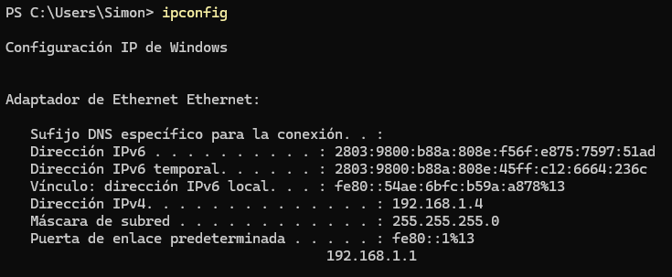

Computadora 2 - Servidor (Linux):

Conectada por Wi-Fi al router.

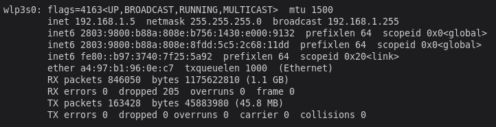

3. **Prueba de Conectividad**: Se realizaron pruebas de conectividad entre las computadoras utilizando comandos como `ping` para verificar que la comunicación estaba funcionando correctamente.

Ping Servidor a Cliente:

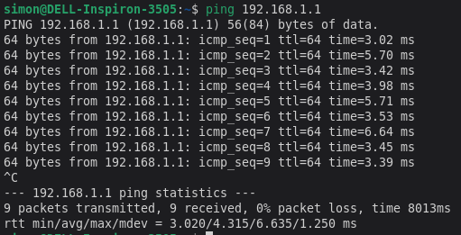

Ping Cliente a Servidor:

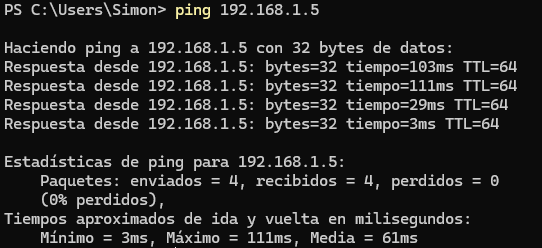

4. **Configuración de Firewall**: Se configuraron las reglas del firewall en ambas computadoras para permitir el tráfico necesario entre ellas.

Configuración del Firewall en el Cliente:

Generalmente Windows no bloquea el tráfico de salida.

Configuración del Firewall en el Servidor:

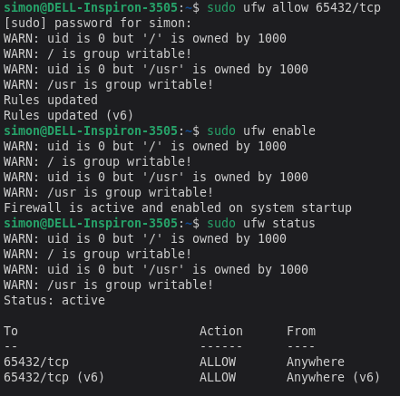

1. **Configuración de Scripts**: Se configuraron los scripts en cada computadora para que se ejecutaran correctamente.

Configuración del Script en el Cliente:

```python
# --- Configuración del Cliente ---
SERVER_HOST = '192.168.1.5'         # La dirección IP del servidor
SERVER_PORT = 65432                 # El puerto del servidor
GROUP_NAME = 'Lenox Legends v2.0'   # Nombre identificatorio del grupo
SEND_INTERVAL_SECONDS = 1           # Intervalo de tiempo entre envíos en segundos
NUM_PACKETS_TO_SEND = 5             # Número de paquetes a enviar
```

>[!NOTE]
> Elegimos 5 paquetes porque sinó la impresión en la consola del servidor era muy grande.

6. **Ejecución de Scripts**: Se ejecutaron los scripts en ambas computadoras para iniciar la comunicación.
El script del cliente envía mensajes al servidor, y el servidor los recibe y los imprime en la consola.

Prueba de Comunicación, Cliente a Servidor:

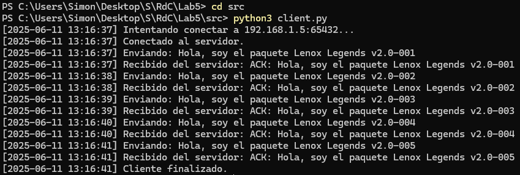

Prueba de Comunicación, Servidor a Cliente:

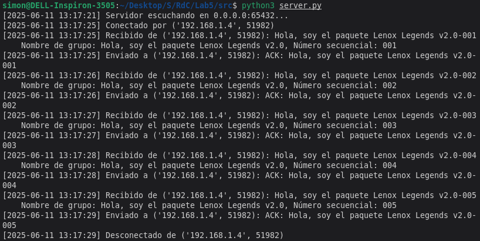

7. **Captura de Paquetes**: Se utilizó Wireshark para capturar los paquetes enviados y recibidos durante la prueba de comunicación.

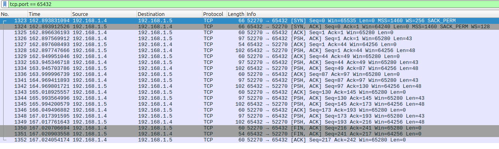

Paquete Aleatorio Capturado:

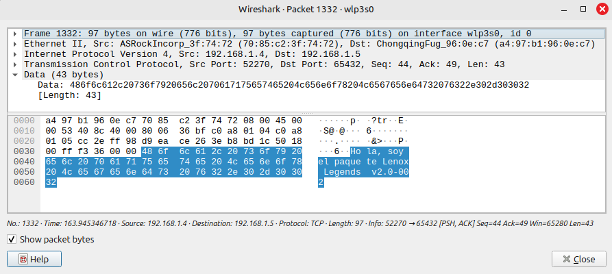

#### b. Agregando Logging

Para agregar logging a los scripts, se utilizan las bibliotecas `logging` y `os` de Python. Se configura el logging para registrar eventos importantes, como el inicio y finalización de la comunicación, así como los mensajes enviados y recibidos.

>[!NOTE]
>Dentro de la carpeta `Logs` se encuentran los archivos de log generados por los scripts.

#### c. Calculo de latencia y jitter

Para calcular la latencia, se implementa una secuencia de 100 paquetes enviados con una frecuencia de 1 segundo entre cada envío. Se registra el tiempo de envío y recepción de cada paquete, y se calcula la latencia como la diferencia entre estos tiempos.

Para calcular la latencia (también conocida como Round-Trip Time o RTT) de los paquetes TCP, modificamos el script del cliente para que envíe 100 paquetes y mida el tiempo que tarda en enviar un paquete y recibir su confirmación (ACK) del servidor. Usaremos el módulo time de Python para estas mediciones. Para calcular el jitter, usaremos las latencias individuales que ya estamos midiendo y mediremos la desviación estándar de las latencias. Para esto, se utiliza la biblioteca `statistics` de Python.

Estos valores se almacenan en un archivo de log para su posterior análisis.

Luego de ejecutar el script, se obtienen los siguientes resultados (para ver completo el log, ver carpeta `Logs`):

```plaintext
--- Estad�sticas de Latencia y Jitter para 100 paquetes ---
Min: 3.267 ms
Max: 127.497 ms
Avg: 28.214 ms
Jitter (StdDev): 24.874 ms
```

### 2. Desarrollo de Scripts (UDP)

UDP es un protocolo sin conexión, lo que significa que no establece una conexión persistente como TCP. Cada paquete (datagrama) se envía de forma independiente, y no hay garantías de entrega, orden ni detección de errores incorporadas en el protocolo mismo. Esto lo hace más rápido y con menos sobrecarga, pero requiere que la aplicación maneje la confiabilidad si es necesaria.

Dado que UDP no tiene ACKs incorporados, tendremos que implementar nuestro propio mecanismo de ACK a nivel de aplicación para poder calcular la latencia y el jitter de manera análoga.

Cambios realizados para la implementación de UDP:

1. **Cambio de Protocolo**: Se cambió el protocolo de TCP a UDP en los scripts del cliente y del servidor.

Esto se logra utilizando el socket `SOCK_DGRAM` en lugar de `SOCK_STREAM`.

```python
socket.socket(socket.AF_INET, socket.SOCK_DGRAM)
```

2. **Operaciones de Envío y Recepción**: Se modificaron las operaciones de envío y recepción para adaptarse al protocolo UDP. En lugar de usar `sendall` y `recv`, se utilizan `sendto` y `recvfrom`. El cliente ya no tiene `s.connect()` porque UDP es sin conexión. Ahora el cliente recibe un pseudo ACK del servidor para cada paquete enviado, esto para poder calcular la latencia y el jitter.

3. **Mecanismo de ACK (A nivel de Aplicación)**:

Dado que UDP no tiene ACKs automáticos, implementamos un ACK simple: el servidor envía de vuelta el mensaje original precedido por "ACK: ". El cliente espera este ACK y, si lo recibe, calcula la latencia.

4. **Manejo de Pérdidas y Timeout (Cliente)**:

UDP no garantiza la entrega. Si un datagrama se pierde en la red (o su ACK de retorno), el cliente nunca recibirá una respuesta. Por eso, `s.settimeout(RECEIVE_TIMEOUT_SECONDS)` es aún más crítico en UDP. Si el timeout expira, el cliente asume que el paquete (o el ACK) se perdió y no se añade a la lista de latencias.
`El RECEIVE_TIMEOUT_SECONDS` se ha ajustado a 2 segundos para asegurar que haya tiempo suficiente para recibir el ACK, siendo mayor que `SEND_INTERVAL_SECONDS`.

5. **Logging**:

Los archivos de log se diferencian con prefijos `udp_`. Adaptamos los mensajes de log para reflejar que es una comunicación UDP.

6. **Elector de Protocolo**: 

Ahora al ejecutar el script, se puede elegir entre TCP y UDP. Esto se logro utilizando la libreria `argparse` de Python para manejar los argumentos de línea de comandos.

Luego de realizar los cambios, se ejecutaron los scripts y se verificó que la comunicación funcionara correctamente.

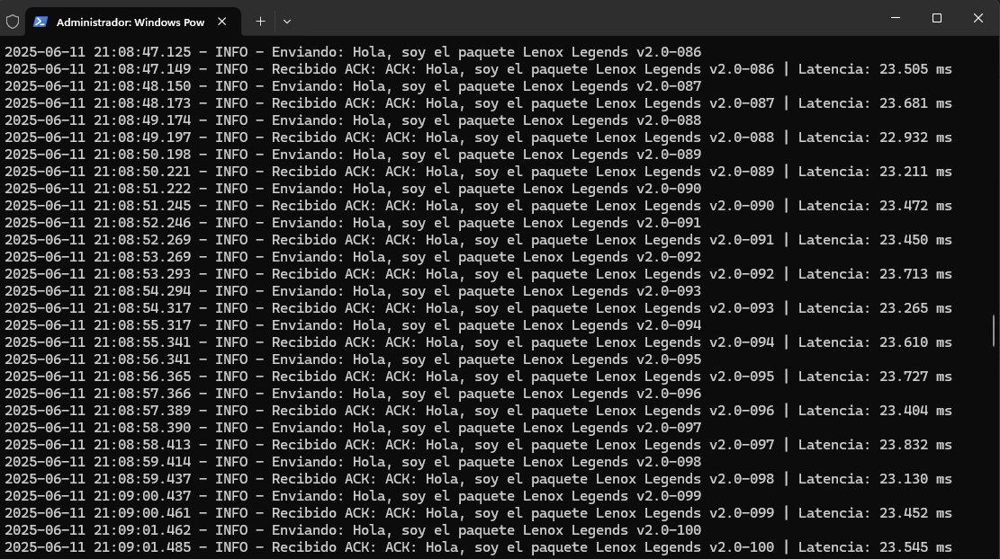

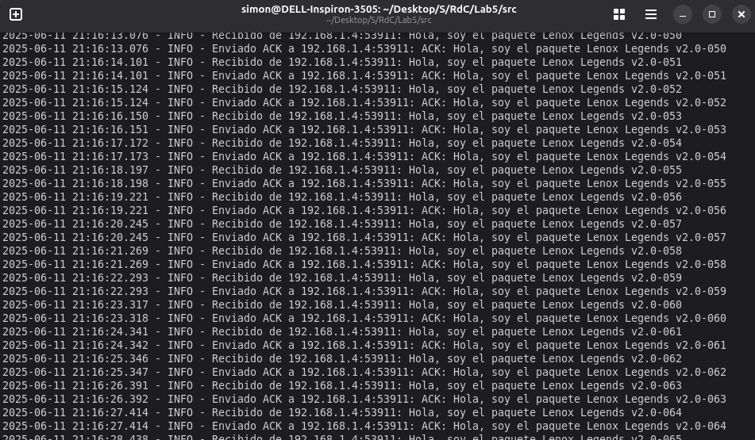

La latencia y el jitter calculados para UDP fueron los siguientes (para ver completo el log, ver carpeta `Logs`):

```plaintext
--- Estad�sticas de Latencia y Jitter para 100 paquetes (UDP) ---
Min: 3.791 ms
Max: 127.540 ms
Avg: 28.766 ms
Jitter (StdDev): 23.189 ms
```

Luego se capturo un paquete UDP con Wireshark para ver el payload.

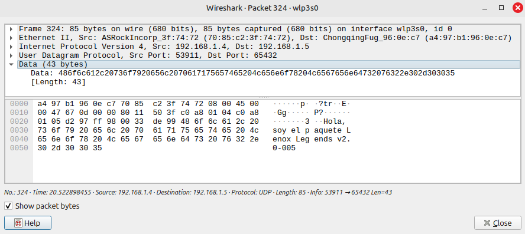

### 3. Comparativa de Paquetes TCP y UDP

El archivo Paquetes-UDP-TCP.pcapng contiene una captura de paquetes que contiene tanto paquetes TCP como UDP captados mediante nuestros scripts.

>[!NOTE]
>COMPLETAR

### 4. Encriptacion

#### ENCRIPTADO SIMETRICO

El cifrado simétrico es un tipo de cifrado en el que se utiliza la misma clave para cifrar y descifrar los datos. 

Al utilizar una única clave, el proceso es sencillo por lo que se consigue un buen rendimiento con un bajo consumo de recursos. Pero esto tambien hace que sea menos seguro que el encriptado asimetrico.

Algunos ejemplos de cifrado simetrico son:

* **AES (Advanced Encryption Standard):** Es uno de los algoritmos de cifrado mas utilizados en el mundo. FUe adoptado como estándar de cifrado por el gobierno de los Estados UNidos y es conocido por su eficiencia y seguridad. Se usa comunmente para protección de datos en disco, conexiones seguras en la web (HTTPS), y aplicaciones de cifrado de archivos.

* **DES(Data Encryption Standard):** FUe uno de los primeros algoritmos de cifrado ampliamente adoptados. Utiliza una clave de 56 bits, lo que hoy en dia se considera inseguro debido a su vulnerabilidad a ataques de fuerza bruta,

* **3DES(Triple DES):** Mejora la seguridad de DES al aplicar el algoritmo tres veces con diferentes claves. Es mas seguro que DES pero tambien es mas lento.

#### ENCRIPTADO ASIMETRICO

A diferencia de la encriptación simétrica, la encriptación de clave asimétrica utiliza una clave pública y una clave privada para encriptar y desencriptar datos. Este metodo elimina la necesidad de compartir la misma clave, ya que una clave(la pública) se utiliza para cifrar, y la otra (la privada) para descifrar. 

Este cifrado, tambien conocido como **criptografia de clave publica**, se utiliza habitualmente para comunicaciones seguras en línea, firmas digitales, y protocolos SSL/TLS para establecer conexiones seguras entre navegadores web y servidores.

Algunos algoritmos de encriptacion asimétrica muy utilizados son:

* **RSA (Rivest-Shamir-Adleman):** RSA es uno de los sistemas de encriptación de clave pública más comunes, conocido por su seguridad y versatilidad.

* **ECC (Criptografia de Curva Elíptica):** La ECC proporciona alta seguridad con longitudes de clave mas cortas, lo que hace mas rapida y eficaz para los dispositivos moviles.

* **DSA (Algoritmo de Firma Digital):** Utilizado principalmente para firmas digitales, el DSA garantiza la autenticidad e integridad de los datos.

#### COMPARACION ENTRE CIFRADO SIMETRICO Y ASIMETRICO.

|                        | **Cifrado Simétrico**                                   | **Cifrado Asimétrico**                                 |
|------------------------|----------------------------------------------------------|----------------------------------------------------------|
| **Claves de uso**      | Misma clave para encriptar y desencriptar               | Par de claves pública y privada                         |
| **Distribución de llaves** | Requiere un intercambio de claves seguro entre las partes | La clave pública puede compartirse abiertamente         |
| **Velocidad**          | Generalmente más rápido, más eficaz para grandes volúmenes de datos | Más lento, más intensivo computacionalmente     |
| **Casos prácticos**    | Cifrado masivo de datos, almacenamiento de archivos, bases de datos | Intercambio seguro de datos, autenticación, firmas digitales |
| **Seguridad**          | Fuerte para entornos privados y controlados             | Mayor seguridad para redes abiertas en las que es posible compartir públicamente |
| **Escalabilidad**      | Gestión de claves menos escalable y compleja para múltiples usuarios | Más escalable, ya que la clave pública puede compartirse con varios usuarios |
| **Algoritmos**         | AES, DES, 3DES                                      | RSA, ECC, DSA                                            |

#### APLICACION EN LOS SCRIPTS DESARROLLADOS

Para nuestro desarrollo, usamos la libreria de Python `cryptography`, que es la mas moderna y mantenida. Encripta con AES(simetrica) y RSA(asimetrica).

Para nuestro caso, elegimos la encriptacion simetrica AES.

#### Caracteristicas de **AES**:

Elegimos AES porque destaca en muchas metricas clave de rendimiento. Sus principales caracteristicas son:

| Característica        | Detalle                                                               |
| --------------------- | --------------------------------------------------------------------- |
| **Tipo de cifrado**   | **Simétrico** – usa la misma clave para cifrar y descifrar            |
| **Algoritmo**         | AES (Advanced Encryption Standard) reemplazó a DES                    |
| **Tamaño de clave**   | 128, 192 o 256 bits (AES-128, AES-192, AES-256)                       |
| **Bloque de datos**   | Opera sobre bloques de **128 bits** (16 bytes)                        |
| **Modo de operación** | ECB, CBC, CFB, OFB, GCM, etc. – define cómo se aplican los bloques    |
| **Velocidad**         | Muy rápida, ideal para grandes volúmenes de datos                     |
| **Seguridad**         | Muy alta si se usa bien (clave segura + modo correcto como CBC o GCM) |
| **Uso típico**        | Cifrado de archivos, comunicaciones seguras, VPNs, almacenamiento     |
| **Estándar**          | Estándar oficial del gobierno de EE.UU. (FIPS-197, 2001)              |

#### Aplicacion

vamos a trabajar con los mismos codigos, pero en el directorio `src/code-with-encrypt`y aplicando la encriptacion solo para TCP.

Antes de instalar, vamos a crear un entorno virtual de python con venv en nuestro espacio de trabajo:
```bash
sudo apt install python3-venv python3-full
python3 -m venv venv
```
Para activar el entorno virtual: 
```bash
source venv/bin/activate
```
Ahora si, podemos instalar la libreria `cryptography`
```bash
pip install cryptography
```
Dentro de `src/code-with-encrypt` creamos el archivo `crypto_utils.py` donde desarrollaremos las funciones necesarias para AES-256. Las funciones que se implementaron son:
* `encrypt_message(message)`y `decrypt_message(message)`: estas funciones las usaremos en los codigos de cliente y servidor.

Tambien se encontrara la clave para el cifrado, la cual es la siguiente:
```py
SECRET_KEY = b'EstaEsUnaKeyDeLenoxLegends2025!!'  # 32 bytes
```
Encriptamos no solo los mensajes, sino tambien los ACK
##### Aplicacion en `client-e.py`:
```py
message = encrypt_message(message)  # Encriptar el mensaje antes de enviarlo
logger.debug(f"Mensaje encriptado: {message}")
s.sendall(message.encode('utf-8'))
#
#
#
#
if protocol == 'TCP':
                        data = s.recv(1024)
                        if not data: # TCP closed
                            logger.warning(f"El servidor cerró la conexión inesperadamente.")
                            break
                        response = decrypt_message(data.decode('utf-8'))  # Decriptar el mensaje recibido
```
##### Aplicacion en `server-e.py`:
Mensaje recibido:
```py
message = decrypt_message(data.decode('utf-8'))
logger.info(f"Recibido de {client_id}: {message}")
```
Envio de respuesta: 
```py
response = encrypt_message(f"ACK: {message}")
logger.debug(f"    Respuesta cifrada: {response}")
conn.sendall(response.encode('utf-8'))
logger.info(f"Enviado a {client_id}: {response}")
```

#### Resultados
Log de Ciente:
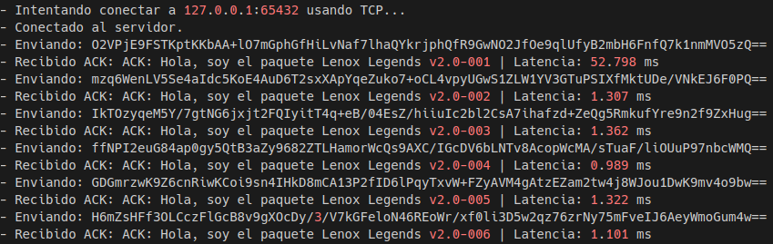

Log de Server:
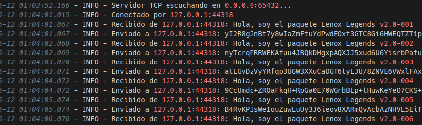

Se puede observar que el cliente envia los mensajes encriptados, y que el Servidor los recibe correctamente, al igual que las respuestas.

Con wireshark vamos a capturar los paquetes.

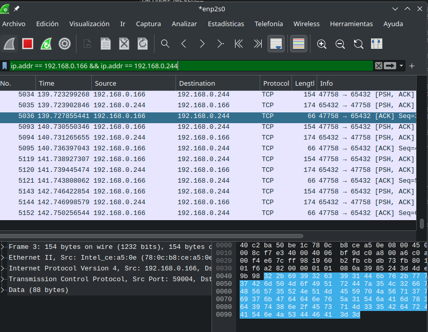

Viendo uno de los paquetes, podemos verificar que ahora no se puede leer claramente el mensaje, lo que nos confirma que los mensajes estan siendo correctamente cifrados.

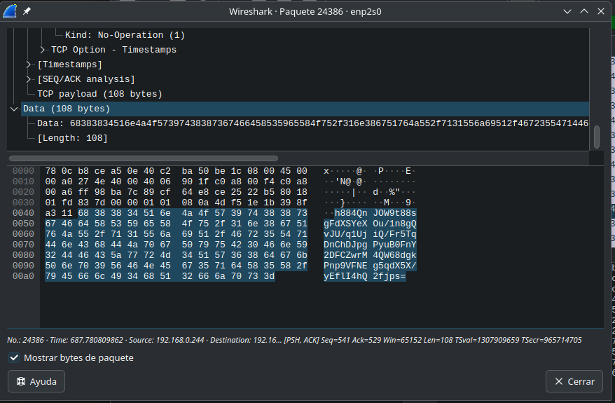

#### PREGUNTA PROPUESTA:
#### ¿Cómo harías para encriptar la comunicación entre las dos computadoras si las mismas se encuentran a kilómetros de distancia y nunca intercambiaron información en el pasado ? Explicar conceptualmente cómo implementarías esto en tus scripts (pero no hace falta que lo programes).

Para encriptar la comunicacion entre dos computadoras que nunca intercambiaron informacion, podemos usar el cifrado asimetrico. Este cifrado, como mencionamos anteriormente, tiene dos claves: publica y privada, lo que permite que dos computadoras establezcan una comunicacion segura sin haberse conocido previamente.

Conceptualmente, se seguirian los siguientes pasos:
1) Cada computadora genera un par de claves.
2) Ambas computadoras se envian sus claves publicas a traves de la red.
3) Usando un algoritmo como DIffle-Hellman o ECDH, cada parte puede calcular la misma clave secreta de la sesion usando su clave privada y la clave publica de la otra parte.
4) A partir de ahi, toda la comunicacion se cifra usando Criptografia simetrica (por ejemplo, usando AES.)

##### Implementacion en los scripts
Para implementar esta propuesta en los scripts actuales, generariamos los pares de claves (publica,privada) en el arranque del cliente y del servidor. Despues, con ECDH derivariamos una clave compartida. Finalmente usariamos esa clave compartida para cifrar y descifrar los mensajes con AES, tal como ya lo hacemos actualmente en los scripts.